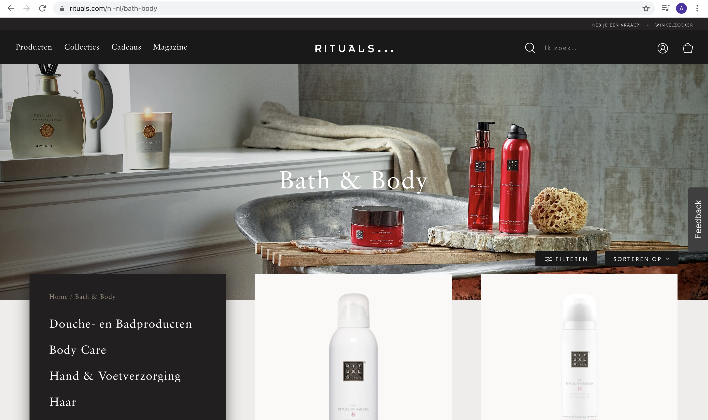

# Procesverslag
**Auteur:** Anna Vianen

Markdown cheat cheet: [Hulp bij het schrijven van Markdown](https://github.com/adam-p/markdown-here/wiki/Markdown-Cheatsheet). Nb. de standaardstructuur en de spartaanse opmaak zijn helemaal prima. Het gaat om de inhoud van je procesverslag. Besteedt de tijd voor pracht en praal aan je website.

## Bronnenlijst
1. https://code-boxx.com/responsive-pure-css-text-slider/#sec-h
2. https://www.w3schools.com/howto/howto_css_menu_horizontal_scroll.asp
3. dlo
4. https://www.w3schools.com/howto/howto_css_image_responsive.asp

## Eindgesprek (week 7/8)
her
Wat er goed ging was de HTMl en CSS. Ik begrijp hoe de structuur in elkaar zit. Wat ik lastig vond, was de slider, carousel en ahmburger menu. Ik hier heel lang over gedaan en veel geexperimenteerd. Uiteindelijk is de slider gelukt. Ook de carousel zit erin, maar die kan nog netter.

**Screenshot(s):**

-screenshot(s) van je eindresultaat-

## Voortgang 3 (week 6)

Deze week had ik veel tijd gestoken in het bekijken van bronnen (voornamelijk dlo nog een paar keer teruggekeken, maar het is toch lastiger om iets zelf te maken dan een opdracht met uitwerkingen erbij), waardoor ik bij sommige problemen een oplossing had. Maar nog steeds liep ik tegen de slider, hamburger menu en carousel aan.

## Voortgang 2 (week 5)

De HTML en CSS lukt me wel aardig, maar als ik dan iets moet namaken wat wat ingewikkelder is - zoals een slider, carousel of hamburger menu - dan lukt dit me niet zo goed.

## Voortgang 1 (week 3)

### Stand van zaken

Het opstellen van HTML ging me wel gemakkelijk af. Ik had eerst content verzameld, waardoor ik snel een ruwe index.html had opgesteld. Om vanuit hier verder te gaan was lastig.

**Screenshot(s):**

-screenshot(s) van hoe ver je bent met korte uitleg-

### Agenda voor meeting

-samen met je groepje opstellen-

| student 1      | student 2          | student 3    | student 4        |
| ---            | ---                | ---          | ---              |
| dit bespreken  | en dit             | en ik dit    | en dan ik dat    |
| an dat ook nog | dit als er tijd is | nog een punt | dit wil ik zeker |
| ...            | ...                | ...          | ...              |

### Verslag van meeting

-na afloop snel uitkomsten vastleggen-

## Breakdownschets (week 1)

## Intake (week 1)
-uitwerken voor de kick-off werkgroep - begin van de eerste week-

**Je startniveau:** blauw

**Je focus:** responsive

**Je opdracht:** https://www.rituals.com/nl-nl/home

**Screenshot(s) van de eerste pagina (small screen):**

**Screenshot(s) van de tweede pagina (small screen):**

